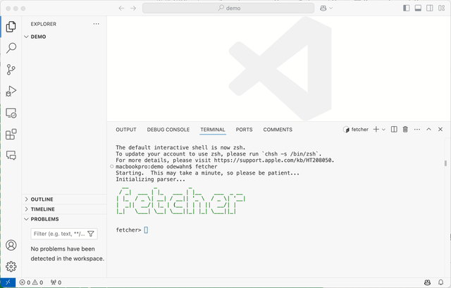

# Fetcher

Fetch content from the O'Reilly Learning platform to store it locally.



# Development

## Install the requirements

```
pip install -r requirements.txt
```

I've noticed that sometimes `pyinstaller` doesn't pick up these packages unless you also run them in the global environment where Python is installed, rather than in the virtual environment. I'm not sure why this is, but it's something to keep in mind.

## To build:

```
pyinstaller --noconfirm --clean fetcher.spec
```

## To package, sign, and notarize

This tool does all the steps in a nice package:

https://github.com/txoof/codesign

Note that I renamed it `pycodesign` when I downloaded it, even though it's called `pycodesign.py` when you download it from the repo.

```
cd dist
pycodesign ../pycodesign.ini

## Building standalone executable

First, be sure you're set up to run pyinstaller by reading [Build an executable with pyinstaller](http://www.gregreda.com/2023/05/18/notes-on-using-pyinstaller-poetry-and-pyenv/). This is another good [tutorial on pyinstaller](https://www.devdungeon.com/content/pyinstaller-tutorial). It took a bit of finagling to make this work, so YMMV.

From the root directory, run the following command:

```

pyinstaller \
 --name=fetcher \
 --add-data="project_template:project_template" \
 --hidden-import=cookiecutter \
 --hidden-import=cookiecutter.main \
 --hidden-import=cookiecutter.extensions \
 --hidden-import=prompt_toolkit \
 --hidden-import=slugify \
 --noconfirm \
 --clean \
 main.py

# This line is necessary because cookiecutter wants to read this file

mkdir -p dist/fetcher/\_internal/cookiecutter
echo "2.6.0" > dist/fetcher/\_internal/cookiecutter/VERSION.txt

```

To view the sizes of the included files, cd into the `dist/_internal` directory and run:

```

du -hs \*

```

Originally, I compiled this using `--onefile` but found that it became incredibly slow to start up. Ths seems to be a common complaint about pyinstaller. I think it also has to do with a virus scanner, which has to scan each file in the package as it's unzipped every time. So, I started just directibuting the dist folder. It's less convenient and clear, but gives an acceptable startup time.

# Build executable part II with codesigning

## Before you start

Set up all the stuff apple requires, as described in the "Setup" section of https://github.com/txoof/codesign/blob/main/Signing_and_Notarizing_HOWTO.md:

- Developer ID Application certificate
- Developer ID Installer certificate

## Building the binary

Go through all the rigamarole to build the binary.

First, set up the keychain stuff:

xcrun notarytool store-credentials ODEWAHN \
 --apple-id andrew@odewahn.com \
 --team-id 8R36RY2J2J

```

# Notes

https://cookiecutter.readthedocs.io/en/1.7.0/advanced/calling_from_python.html

When testing cookiecutter:

```
init --identifier=9781491973882 --dir=~/Desktop/content
```
